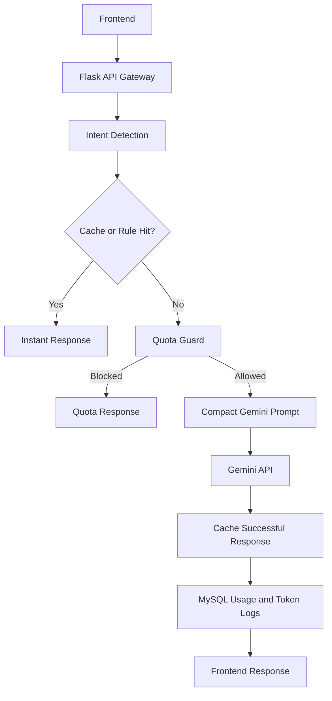

# VaidyaMedX AI Backend: Optimized Architecture

## Overview

The AI Wellness subsystem now uses a cost-optimized Gemini hybrid architecture:

1. JWT-authenticated backend route receives the request.
2. Response cache and common wellness rules run first.
3. User and organization quota checks prevent runaway billing.
4. Gemini is called only for uncached, non-rule requests.
5. MySQL stores conversation, usage, token, cost, and subscription analytics.

## Flow

## Cost Optimizations

- Redis cache with memory fallback.
- Small prompt template with no repeated large context.
- `GEMINI_MAX_OUTPUT_TOKENS` cap.
- Rule responses for common wellness FAQs.
- `ai_usage_logs` and `token_tracking` estimate spend.
- `/api/wellness/admin/ai-usage` reports cache savings and Gemini cost.

## Removed Legacy AI

The local TinyLlama, FAISS RAG, and standalone Ayurveda AI services were removed from the backend request path and dependency list to reduce server memory, cold-start time, and deployment cost.
